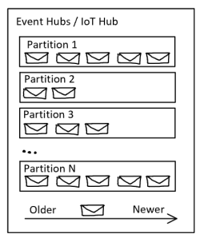
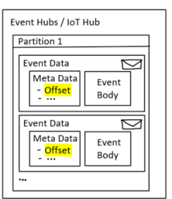
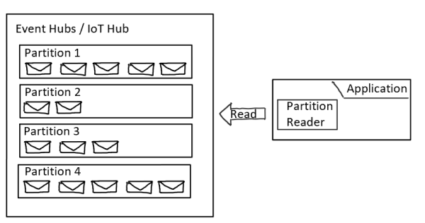
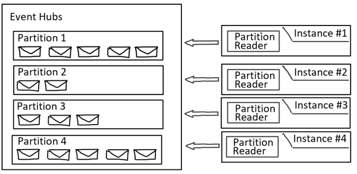
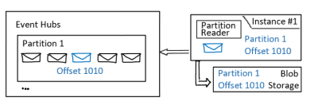

Messaging or eventing systems are widely used, for example, to enable asynchronous communication between microservices or distributed systems on the same message channel. These systems are also often used to distribute message processing across easy-to-scale worker processes.

Eventing systems are often based on two different architectures:

- [Competing Consumer](./competing-consumers.yml)
- Partitioned Consumer

A basic understanding of these architectures and the functionalities that are provided is helpful in selecting a system that supports the requirements of the respective applications.

### Delivery Patterns

Eventing systems often provide so-called delivery guarantees which describes functionality provided by the systems:

- ***At-Most-Once***: A message is delivered zero or one times. This means a message could get lost and there's no guarantee that all messages published to the messaging system will be forwarded to potential consumers.
- ***At-Least-Once***: A message can be potentially delivered multiple times. This means a message can't get lost but it can be duplicated.
- ***Exactly-Once***: A message will be delivered one time. This means a message can't get lost and can't get duplicated.

At-Most-Once is the cheapest with the highest performance and the least effort for implementation. For example, it is not necessary to save a state whether the event has already been delivered or read. A simple fire-and-forget functionality can be implemented.

At-least-once must implement retry mechanisms to receive or resend the event again, e.g. in the event of transient errors such as DNS hick-up or connectivity loss. An acknowledge system at the receiving application must also be implemented.

Exactly-Once is very often required by applications but is the most complex to implement by eventing systems and thus often limited in scaling or scalable only with high resource expenditure.

[Azure IoT Hub](https://learn.microsoft.com/en-us/azure/iot-fundamentals/) and [Azure Event Hubs](https://learn.microsoft.com/en-us/azure/event-hubs/event-hubs-about) are both based on the principle of partitioned consumers. Both systems implement [At-Least-Once](https://learn.microsoft.com/en-us/azure/event-hubs/event-hubs-event-processor-host) delivery guarantees with high scalability and reasonable costs. Both expect the implementation of client-side acknowledgement functionality. In the context of IoT Hub and Event Hubs this functionality is referred to as check pointing.  

## Partitioned Consumers

### Overview IoT Hub / Event Hubs

Individual events are stored in IoT Hub and Event Hubs in so-called partitions. As soon as new events arrive, they are stored at the end of the respective partition. A partition can thus be considered a "commit log".

In IoT Hub / Event Hubs, individual events are not removed from the "commit log" after exceeding the maximum [Retention Time](https://learn.microsoft.com/en-us/azure/event-hubs/event-hubs-faq). Rather, larger memory blocks are removed from the "commit log". This happens when the retention time of all events has been exceeded ***and*** an entire memory area within a partition is filled. For this reason, there can be situations where IoT Hub and Event Hubs deliver events whose retention time has already been exceeded.

Within a partition, IoT Hub and Event Hubs store metadata, such as the stream offset, in addition to the event data:  

An offset is the position of an event within a partition. The offset is a byte numbering of the event and together with the Partition Id it uniquely identifies the event. Offset and Partition Id enables an event consumer or client application to specify a point in the event stream from which they want to begin reading events. The offset can be specified as a offset value or a timestamp using IoT Hub / Event Hubs.

### Processed Events

In contrast to event systems with competing consumers, an eventing system with partitioned consumer does not manage or store information about which events have already been retrieved and processed by clients. This functionality is expected to be provided by the client.

#### Partitions & Partition Reader

The example below shows an instance of Event Hubs / IoT Hub with 4 partitions and an application with a partition reader which is used to read and process events:

In order to implement maximum parallelism when reading the events, it is recommended to implement only one active partition reader per partition. This means that in the example 4 instances of the application should be started, each of which connects to a partition to read events from this partition.  

Theoretically, a maximum of 5 partition readers can simultaneously read from a single partition. This is not recommended because each partition reader has access to all events in the respective partition and therefore multiple processing of the events takes place or a mechanism for synchronizing the partition reader must be implemented. This often leads to complex custom solutions which should be avoided.

If there's a need to process an event several times, e.g. to archive the event in a long-term storage and at the same time process the event and update a NRT dashboard with information, the use of consumer groups is recommended.  

#### Consumer Groups

Theoretically, a maximum of 5 partition readers can compete with a single partition. This is not recommended because each partition reader has access to all events in the respective partition and therefore a multiple processing of the events takes place or a mechanism for synchronizing the partition reader must be implemented. This often leads to complex custom solutions.  

If an event is to be processed several times, e.g. to archive the event in a long-term storage and at the same time to fill an NRT dashboard with information, the use of consumer groups is recommended.  

Details Consumer groups can be found [here](https://learn.microsoft.com/en-us/azure/event-hubs/event-hubs-features)

#### Checkpointing
In order to read events from a partition, the respective application or partition reader must connect to a partition and tell the eventing system from which offset events should be read. This requires the client to store information about which event has already been processed. In the broadest sense, this information can be compared to a "client-side cursor".  

This process is called **checkpointing***. Checkpointing is a process by which clients mark or commit their position within a partition event sequences. It is the responsibility of the client application to store the checkpointing information (partition id & offset of already processed events). In order not to lose the checkpointing information after a possible restart, it is recommended to save this with the help of an external service.  

 

For checkpointing, various services such as [Azure Blob Storage](https://azure.microsoft.com/en-us/products/storage/blobs/), [Azure Cosmos DB](https://learn.microsoft.com/en-us/azure/cosmos-db/introduction), [Azure Cache for Redis](https://learn.microsoft.com/en-us/azure/azure-cache-for-redis/cache-overview), etc. are available.  

When selecting the service to persist the checkpoint information, scalability and reliability requirements must be weighed. Best practice is not to checkpoint every single event processed, but to checkpoint event batches. This is done in order not to overload the selected service or to avoid creating a bottle-neck in event processing.

## SDK Unterstützung
Microsoft provides [SDKs](https://learn.microsoft.com/en-us/azure/event-hubs/sdks) for many languages. These simplify the checkpointing process. In addition, the SDKs provide functionality to customize the mapping of partition readers to partitions with the number of instances which are spun up to read from partitions.

## Next steps

## Related resources
